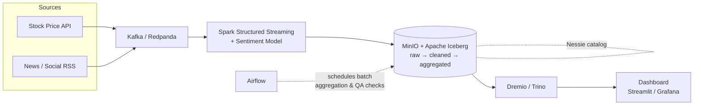

# Stock Sentiment Pipeline

Real-time data pipeline that ingests stock price and news/social sentiment data, processes it through a streaming pipeline, and serves it on a Data Lakehouse — with a web dashboard to visualize price movement against sentiment trends.

> **Status:** Phase 1 (Data Engineering) — in progress
> **Senior Capstone Project**, Computer Science, Thammasat University

---

## Overview

Investors and analysts often have to check stock prices and financial news separately, then manually judge whether a headline is moving the market. This project automates that: it streams stock prices and news/social data in parallel, scores sentiment on incoming news, and stores everything in a queryable Data Lakehouse so the relationship between price and sentiment can be seen on one dashboard, in near real time.

The project is split into two phases:

| Phase | Timeline | Focus |
|---|---|---|
| **Phase 1** (this repo, current) | 15 Sep – 30 Nov | Data Engineering — build the end-to-end pipeline |
| **Phase 2** | 1 Jan – April | Agentic AI with LLM — daily news summary + News RAG Q&A |

---

## Architecture



**Component breakdown**

| Layer | Tool | Purpose |
|---|---|---|
| Ingestion | Kafka / Redpanda | Streams stock prices + news/social data into separate topics |
| Processing | Spark Structured Streaming | Cleans, transforms, and joins sentiment with price data (windowed join) |
| Sentiment | LSTM / FinBERT (pretrained) | Scores incoming news/social text, run inline in Phase 1 |
| Storage | MinIO + Apache Iceberg | Object storage + table format (raw → cleaned → aggregated layers) |
| Catalog | Nessie | Git-like version control for Iceberg tables (dev/prod branching) |
| Orchestration | Airflow | Schedules batch aggregation and data quality checks |
| Query | Dremio / Trino | SQL query engine across the Lakehouse |
| Serving | Streamlit / Grafana | Web dashboard for price, sentiment, and news |

---

## Features (Phase 1)

- **Price dashboard** — current price, % change, price trend over time
- **Sentiment overview** — positive / neutral / negative breakdown for recent news
- **Price vs. sentiment chart** — combined view to spot correlation patterns
- **Live news feed** — latest headlines with source and sentiment score
- **Filter controls** — pick stock symbol, time range, and news source
- **System health view** — Kafka ingestion delay, Spark streaming status, active Nessie branch (for pipeline monitoring)

---

## Tech Stack

- **Streaming:** Kafka / Redpanda, Spark Structured Streaming
- **Storage:** MinIO, Apache Iceberg, Nessie
- **Orchestration:** Apache Airflow
- **Query:** Dremio / Trino
- **Dashboard:** Streamlit / Grafana
- **Infra:** Docker Compose

---

## Getting Started

> Setup instructions will be filled in as each component is built out.

```bash
git clone https://github.com/Surabodee-Phasuk/Stock-Sentiment-Pipeline.git
cd Stock-Sentiment-Pipeline
docker compose up -d
```

### Prerequisites

- Docker & Docker Compose
- Python 3.10+
- API keys for chosen stock price / news data sources (see `.env.example`)

---

## Project Structure

```
Stock-Sentiment-Pipeline/
├── ingestion/          # Kafka producers for stock price & news data
├── streaming/           # Spark Structured Streaming jobs + sentiment scoring
├── lakehouse/           # MinIO / Iceberg / Nessie configuration
├── orchestration/        # Airflow DAGs for batch aggregation & data quality
├── dashboard/            # Streamlit / Grafana dashboard
├── docker-compose.yml
└── README.md
```

---

## Roadmap

- [x] System design & architecture
- [ ] Infra bootstrap (MinIO + Nessie + Iceberg + Dremio running)
- [ ] Stock price + news ingestion into Kafka
- [ ] Spark streaming + inline sentiment scoring
- [ ] Iceberg tables (raw / cleaned / aggregated) + Airflow batch jobs
- [ ] Dashboard (price, sentiment, news feed)
- [ ] **Phase 2:** LLM daily news summary + sentiment explanation on the Stock Detail page
- [ ] **Phase 2:** News RAG Q&A ("Ask AI" tab in the bottom menu), scoped to the project's stock list
- [ ] **Phase 2:** evaluation — ~50 sampled summaries, 50–100 RAG test questions vs. LLM without RAG

See [docs/09_phase2_llm_rag_plan.md](docs/09_phase2_llm_rag_plan.md).

---

## Non-functional Requirements

- **Idempotency** — duplicate records are prevented via Iceberg merge/upsert
- **Fault tolerance** — Kafka consumer groups + Spark checkpointing
- **Data quality** — schema, null, and outlier checks before data reaches the cleaned layer
- **Scalability** — designed to add more stock symbols or news sources without re-architecting

---

## Author

**Surabodee Phasuk (Mai)**
Computer Science, Thammasat University
