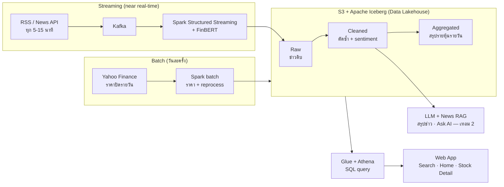

# Stock Sentiment Pipeline

ระบบติดตามและสรุปทิศทางความรู้สึกของข่าวหุ้นแบบใกล้เคียงเวลาจริง เพื่อสนับสนุนการติดตามข้อมูลของนักลงทุนรายย่อย (Stock News Sentiment)

> **Status:** Term 1/2569 — Proof of Concept
> **Senior Capstone Project**, Computer Science, Thammasat University
>
> **Team:** สุรบดี ผาสุข (6609650707), รพินทร์ นะราช (6609650624) ·
>
> **Advisor:** ผศ.ดร.ปกป้อง ส่องเมือง (Asst.Prof.Dr. Pokpong Songmuang)
>
>แหล่งอ้างอิงหลัก: [Project Proposal](docs/assets/Project_Proposal_Stock_News_Sentiment.pdf) · เอกสารออกแบบ: [docs/](docs/README.md) · งานทั้งหมด: [BOARD](docs/issues/BOARD.md)

---

## Overview

โครงงานพัฒนาระบบติดตามทิศทางข่าวหุ้นสหรัฐฯ แบบใกล้เคียงเวลาจริง บน **Data Lakehouse** ที่รองรับข่าวย้อนหลังหลายปีและข่าวใหม่ ณ ปัจจุบัน

นักลงทุนรายย่อยต้องติดตามข่าวจำนวนมากจากหลายแหล่งและตีความเองว่าเป็นบวกหรือลบต่อหุ้นที่ถืออยู่ ระบบนี้รวมข่าวไว้ที่เดียว จำแนก sentiment ด้วย **FinBERT** เก็บข่าวดิบไว้ประมวลผลใหม่ได้เมื่อเปลี่ยนโมเดล (time travel / reprocess) แสดงภาพรวม sentiment เทียบกับราคาปิดรายวัน และในเทอม 2 เพิ่ม **LLM สรุปข่าวประจำวัน** กับ **News RAG** ตอบคำถามจากข่าวพร้อมแหล่งอ้างอิง

| เทอม | ช่วงเวลา | เป้าหมาย |
|---|---|---|
| **เทอม 1/2569** (ปัจจุบัน) | Proof of Concept | พิสูจน์ว่าเครื่องมือแต่ละตัวใช้งานได้จริง |
| **เทอม 2/2570** | พัฒนาเต็ม | Pipeline, FinBERT, เว็บแอป, LLM สรุปข่าว และ News RAG ครบตามวัตถุประสงค์ |

---

## Architecture



ข้อมูลเข้า 2 ทาง แต่ลงตาราง Iceberg ชุดเดียวกัน ซึ่งเป็นสิ่งที่โครงงานต้องพิสูจน์ว่า Data Lakehouse ทำงานได้จริง

| Layer | Tool | หน้าที่ |
|---|---|---|
| Ingestion (streaming) | Kafka | รับข่าวใหม่จาก RSS / News API ทุก 5–15 นาที |
| Processing (streaming) | Spark Structured Streaming | ทำความสะอาด ตัดข่าวซ้ำ และจำแนก sentiment |
| Processing (batch) | Spark batch | โหลดราคาปิดรายวัน และประมวลผล sentiment ใหม่จากชั้น Raw |
| Sentiment | FinBERT | จำแนกข่าวเป็น Positive / Neutral / Negative |
| Storage | Amazon S3 + Apache Iceberg | Raw / Cleaned / Aggregated, time travel, schema evolution |
| Catalog + Query | AWS Glue + Amazon Athena | SQL query ข้ามข่าว streaming และราคา batch |
| Serving | Web App | Search, Home (Watchlist), Stock Detail, Ask AI |
| AI (เทอม 2) | LLM + RAG | สรุปข่าวประจำวัน และตอบคำถามจากข่าวพร้อมแหล่งอ้างอิง |

---

## Objectives & Targets

ค่าเป้าหมายเป็นค่าเบื้องต้น จะยืนยันหลังทำ PoC ในเทอม 1

| # | วัตถุประสงค์ | ตัวชี้วัด / เป้าหมาย |
|---|---|---|
| 1 | Data Lakehouse บน S3 + Iceberg (~50 หุ้น) | query ข่าวคู่กับราคาผ่าน Athena ≤ 5 วินาที, duplicate rate = 0% ในชั้น Cleaned, ประมวลผล sentiment ใหม่จาก Raw ได้, สาธิต time travel และ schema evolution ได้จริง |
| 2 | Pipeline รับข่าวใกล้เคียงเวลาจริง (Kafka + Spark Structured Streaming) | ข่าวใหม่แสดงบนเว็บภายใน 15 นาที, ทำงานต่อเนื่อง ≥ 7 วัน ไม่สูญหายข่าว (กู้คืนจาก checkpoint ได้) |
| 3 | จำแนก sentiment รายข่าวด้วย FinBERT | Macro-F1 ≥ 0.70 บนชุดข่าว 300 ข่าวที่ทีมติดป้ายเอง |
| 4 | เว็บแอป (Search, Home, Stock Detail) | ทดสอบผู้ใช้ 10 คน ได้คะแนน SUS ≥ 68 |
| 5 | LLM สรุปข่าวประจำวัน + News RAG | สรุป 50 ชิ้นไม่มีข้อมูลแต่งขึ้น ≥ 90%; คำถาม 50–100 ข้อ ค้นข่าวถูกหุ้น อ้างอิงแหล่งถูกต้อง และปฏิเสธคำถามนอกขอบเขตได้ ≥ 90% |

---

## Scope

| ด้าน | อยู่ในขอบเขต | ไม่อยู่ในขอบเขต |
|---|---|---|
| หุ้น | หุ้นสหรัฐฯ ~50 ตัว หลายกลุ่มอุตสาหกรรม (Tech, Auto, Energy, Space) | หุ้นไทย, คริปโต |
| ข่าว | ข่าวภาษาอังกฤษ ย้อนหลังตั้งแต่ปี 2020 และข่าวใหม่ทุก 5–15 นาที | โพสต์โซเชียล (X, Reddit, StockTwits) |
| ราคา | ราคาปิดรายวันจาก Yahoo Finance ตั้งแต่ปี 2020 | ราคาระหว่างวัน |
| การวิเคราะห์ | sentiment รายข่าวและภาพรวมรายหุ้นรายวัน เทียบกับทิศทางราคาปิด | ทำนายราคา, คำแนะนำซื้อขาย |
| เว็บแอป | หน้า Search, Home (Watchlist), Stock Detail, Ask AI | แอปมือถือ |
| AI | LLM สรุปข่าว, RAG ตอบเฉพาะหุ้นในระบบพร้อมแหล่งอ้างอิง | ฝึกโมเดลภาษาใหม่เอง |

---

## Tech Stack

- **Streaming:** Kafka, Spark Structured Streaming
- **Batch:** Spark
- **Sentiment:** FinBERT
- **Storage:** Amazon S3, Apache Iceberg
- **Catalog / Query:** AWS Glue, Amazon Athena
- **AI (เทอม 2):** LLM + RAG (ผู้ให้บริการ LLM ยังไม่ล็อก)
- **Web App:** ยังไม่ล็อก (ตัดสินใจใน F5-01 ดู [docs/adr/](docs/adr/))

---

## Getting Started

> ขั้นตอนติดตั้งจะเติมเมื่อพัฒนาแต่ละส่วนเสร็จ

```bash
git clone https://github.com/Surabodee-Phasuk/Stock-Sentiment-Pipeline.git
cd Stock-Sentiment-Pipeline
```

### Prerequisites

- บัญชี AWS (S3, Glue, Athena) พร้อมตั้ง budget alert
- Docker & Docker Compose (Kafka / Spark สำหรับพัฒนาในเครื่อง)
- Python 3.10+
- API key ของแหล่งข่าว (ดู `.env.example` เมื่อมีการเพิ่ม)

---

## Project Structure

```
Stock-Sentiment-Pipeline/
├── AGENTS.md / CLAUDE.md   # ชี้ไป docs/agents.md
├── .github/                # PR template, issue template, CI
├── config/                 # tickers.yaml
├── infra/                  # docker-compose (Kafka, Spark), AWS setup
├── ingestion/              # news → Kafka, Yahoo Finance daily close
├── streaming/              # Spark Structured Streaming + FinBERT
├── batch/                  # ราคาปิด, aggregation รายวัน, reprocess
├── lakehouse/              # Iceberg DDL, Athena queries, demos
├── sentiment/              # FinBERT wrapper, gold set, eval
├── ai/                     # LLM summary + News RAG
├── webapp/                 # Web App + API
├── tests/                  # integration / e2e / reliability
└── docs/                   # design docs, ADR, issues + BOARD
```

รายละเอียดและเจ้าของแต่ละโฟลเดอร์: [docs/06-system-architecture.md](docs/06-system-architecture.md)

---

## Workflow

**1 issue = 1 branch = 1 PR** — ทุกงานมี issue ใน [docs/issues/BOARD.md](docs/issues/BOARD.md) พร้อมชื่อ branch ที่กำหนดไว้แล้ว

- `main` protected, merge ผ่าน PR (squash) หลังผ่าน CI + review จากสมาชิกอีกคน
- ชื่อ branch: `<type>/<issue-id>-<slug>` เช่น `feat/f1-01-news-collector`
- Commit: Conventional Commits ภาษาอังกฤษ เช่น `feat(ingestion): add RSS collector`
- PR title: `[F1-01] Short summary`

กฎเต็ม: [docs/agents.md](docs/agents.md)

---

## Roadmap

**เทอม 1/2569 — Proof of Concept**
- [x] ออกแบบระบบและสถาปัตยกรรม
- [ ] ดึงข่าวสดและราคา: ครบ 10 หุ้น
- [ ] Kafka → Spark → Iceberg: ข่าวใหม่ปรากฏในตารางภายใน 15 นาที
- [ ] ราคาปิดแบบ batch ในตารางชุดเดียวกับข่าว: query ผ่าน Athena ได้
- [ ] Time travel และ reprocess: สาธิตกับข่าวชุดทดสอบ
- [ ] FinBERT: วัด F1 บน 100 ข่าว และวัดจำนวนข่าวต่อวินาที
- [ ] LLM สรุปข่าว: 5 ชิ้น ตรวจด้วยคน พร้อมค่าใช้จ่ายต่อชิ้น
- [ ] News RAG: ตอบ 10 คำถามทดสอบพร้อมแหล่งอ้างอิง
- [ ] UX/UI: Prototype ครบ 4 หน้า และหน้า Stock Detail ดึงข้อมูลจริงได้

**เทอม 2/2570 — พัฒนาเต็ม** ตามวัตถุประสงค์ทั้ง 5 ข้อ

---

## Risks

| ความเสี่ยง | แนวทางรับมือ |
|---|---|
| ข่าวมีปริมาณไม่มาก (~500 ข่าว/วัน) อาจถูกถามว่าทำไมต้องใช้ Data Lakehouse | พิสูจน์ด้วยความสามารถ (time travel, reprocess จาก Raw, batch + streaming ในตารางเดียว) แทนปริมาณ และระบุเป็นข้อจำกัด |
| API ฟรีจำกัดจำนวนครั้ง ข่าวสดช้ากว่าจริง 5–15 นาที | ใช้คำว่า near real-time และรวมหลายแหล่ง |
| เริ่มระบบใหม่ยังไม่มีข่าวสะสม หน้าเว็บและ RAG มีข้อมูลน้อยช่วงแรก | เปิด pipeline เก็บข่าวให้เร็วที่สุด |
| yfinance ไม่ใช่ API ทางการ อาจโดนบล็อกชั่วคราว | ดึงวันละครั้งและเว้นจังหวะ |
| ค่าใช้จ่าย AWS และ LLM เกินงบ | ตั้ง budget alert และวัดค่าใช้จ่ายต่อคำถาม |

---

## Author

**Surabodee Phasuk (Mai)**
Computer Science, Thammasat University
