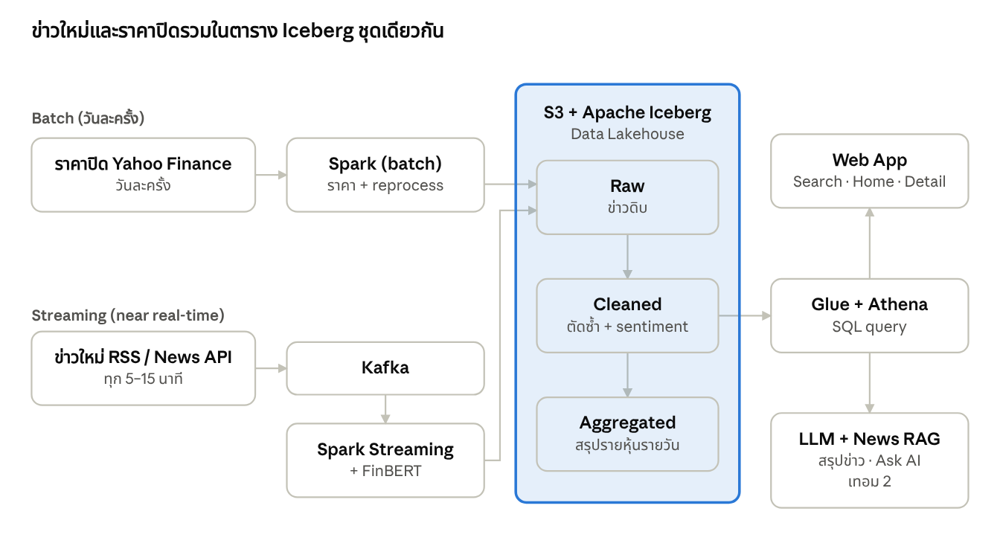
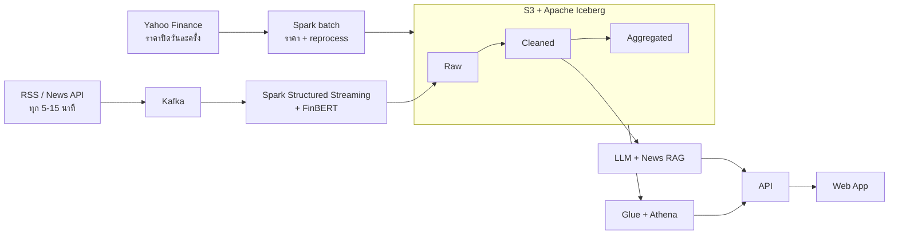

# 06 — System Architecture

ข้อมูลเข้า 2 ทาง แต่ลงตาราง Iceberg ชุดเดียวกัน ซึ่งเป็นสิ่งที่โครงงานต้องพิสูจน์ว่า Data Lakehouse ทำงานได้จริง



*แผนภาพจาก [Project Proposal](assets/Project_Proposal_Stock_News_Sentiment.pdf) หน้า 3*



- **Streaming:** ข่าวใหม่ผ่าน Kafka และ Spark Structured Streaming ทุก 5–15 นาที
- **Batch:** ราคาปิดรายวันจาก Yahoo Finance วันละครั้ง และงาน reprocess sentiment จากชั้น Raw เมื่อเปลี่ยนโมเดล
- **Serving:** เว็บแอปอ่านชั้น Aggregated ผ่าน Athena; LLM และ RAG ใช้ข่าวจากชั้น Cleaned

## โครงสร้าง repository
ทุกโฟลเดอร์ถูกสร้างไว้แล้วพร้อม README บอกขอบเขต ห้ามสร้างโฟลเดอร์ระดับบนสุดใหม่โดยไม่มี ADR

```
Stock-Sentiment-Pipeline/
├── AGENTS.md / CLAUDE.md   # ชี้ไป docs/agents.md (กฎสำหรับคนและ AI)
├── .github/                # PR template, issue template, CI
├── config/                 # tickers.yaml, ค่าคงที่ร่วม
├── infra/                  # docker-compose (Kafka, Spark local), AWS setup scripts
├── ingestion/              # news collector → Kafka, Yahoo Finance daily close
├── streaming/              # Spark Structured Streaming: Kafka → Raw → Cleaned + FinBERT
├── batch/                  # Spark batch: ราคาปิด, aggregation รายวัน, reprocess
├── lakehouse/              # DDL ตาราง Iceberg, Athena queries, demo time travel
├── sentiment/              # FinBERT wrapper, gold set, evaluation scripts
├── ai/                     # LLM summary + News RAG (เทอม 1 PoC, เทอม 2 เต็ม)
├── webapp/                 # เว็บแอป + API layer
├── tests/                  # integration / e2e / reliability tests
└── docs/                   # เอกสารนี้
```

| โฟลเดอร์ | Primary owner | Feature |
|---|---|---|
| `infra/`, `config/` | M1 | INFRA |
| `ingestion/` | M1 | F1 |
| `lakehouse/`, `streaming/` (Raw/Cleaned) | M1 | F2 |
| `sentiment/`, FinBERT ใน `streaming/` | M2 | F3 |
| `batch/` | M2 | F4 |
| `webapp/` | M2 | F5 |
| `ai/` | M1 + M2 | F6, F7 |
| `tests/` | ทุกคน | QA |

## Request flow (Stock Detail)
1. ผู้ใช้เปิด `/stock/RKLB`
2. API query Athena: `sentiment_daily` + `daily_price` (30 วัน) และ `clean_news` JOIN `news_sentiment` (ข่าวล่าสุด 20 ข่าว)
3. (เทอม 2) API ดึงสรุป LLM ของวันนั้นจาก cache
4. Web App แสดงผล
